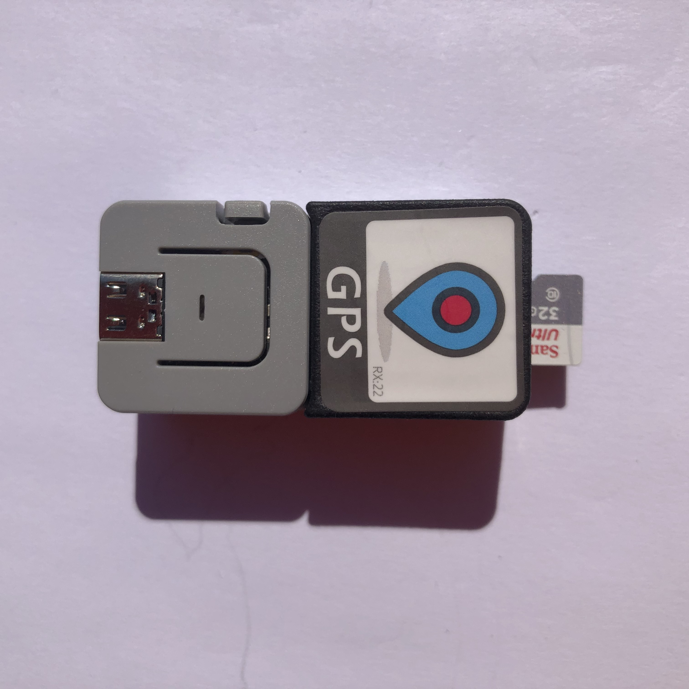
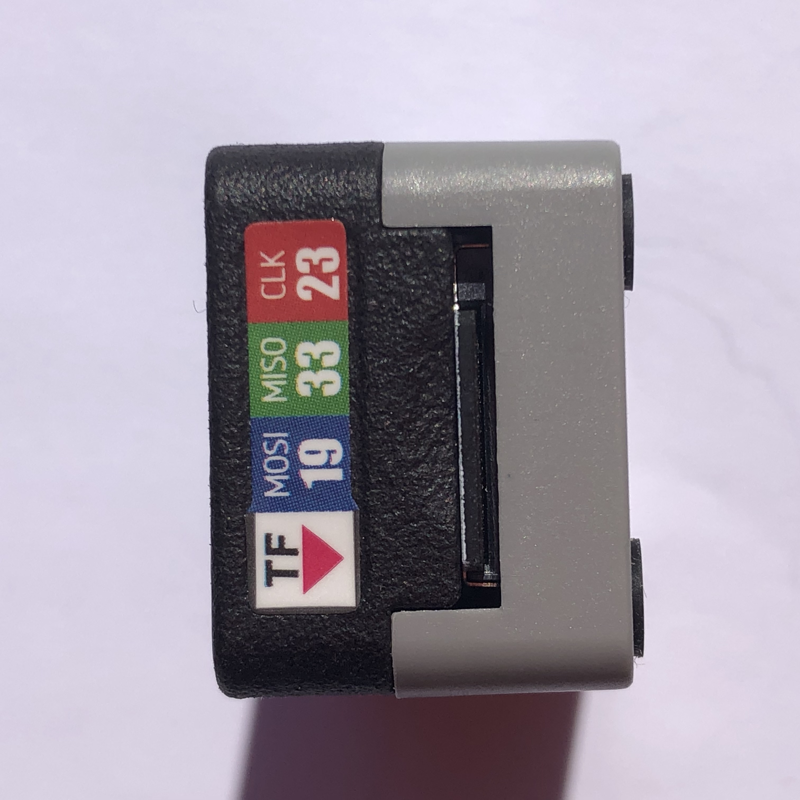

# M5 Matrix²
Software for M5 Matrix^2 a PCB that fits 4x4 @m5stack ATOM Matrix modules

 1 x [M5 Matrix² PCB](https://github.com/sebastius/m5atommatrix) by [Sebastius](https://github.com/sebastius)

 1 x [M5 Matrix² case](https://www.thingiverse.com/thing:4935549) by [Pwuts](https://www.thingiverse.com/Pwuts) 

 1 x [M5 ATOM GPS Kit](https://docs.m5stack.com/en/atom/atomicgps) by [M5Stack](https://www.m5stack.com) 

16 x [M5 ATOM Matrix](https://docs.m5stack.com/en/core/atom_matrix) by [M5Stack](https://www.m5stack.com) 

